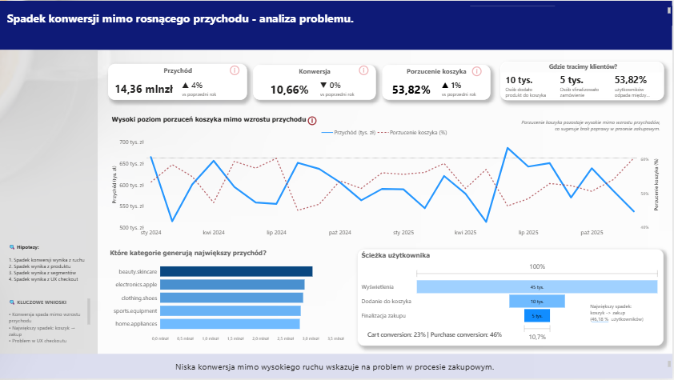

# 🛒 E-commerce Checkout Analysis

## 📌 Project Overview

This project analyzes the causes of high cart abandonment
in an e-commerce environment.

The goal was to identify the key drivers of low conversion
and recommend improvements based on data.

---

## 📊 Dashboard Preview



---

## 🎯 Business Problem

• Conversion: ~10.6%  
• Cart abandonment: ~53%  
• Revenue: 14.36M PLN  

A significant number of users add products to cart,
but do not complete the purchase.

---

## 🎯 Goal

Identify the root cause of low conversion
and propose data-driven improvements.

---

## 🧠 Approach

The analysis was based on hypothesis testing:

• traffic impact ❌  
• product offering ❌  
• user segments ❌  
• checkout UX ✅  

---

## 🔍 Key Findings

• The main issue occurs in the checkout process  
• Payment problems account for ~58% of drop-off  
• High error rate (12%) impacts transactions  
• Slow loading time (~3.5s) reduces conversion  

---

## 💡 Recommendations

• Simplify checkout flow  
• Improve payment UX  
• Run A/B tests  
• Monitor technical errors  

---

## 📈 Expected Impact

• +2–3 percentage points in conversion  
• -10–20% reduction in abandonment  
• Increased revenue without more traffic  

---

## 💻 SQL Analysis

Example query used in the analysis:

```sql
SELECT 
    COUNT(DISTINCT o.user_id) * 1.0 / COUNT(DISTINCT s.user_id)
FROM sessions s
LEFT JOIN orders o ON s.user_id = o.user_id;
```

---

## 👩‍💻 About the Author

**Barbara Łukaszewska**  
📊 Data Analyst | Power BI | SQL  
📍 Warszawa  

This project was created as part of a BI analysis case study,
focused on identifying the root cause of conversion drop
in an e-commerce environment.


